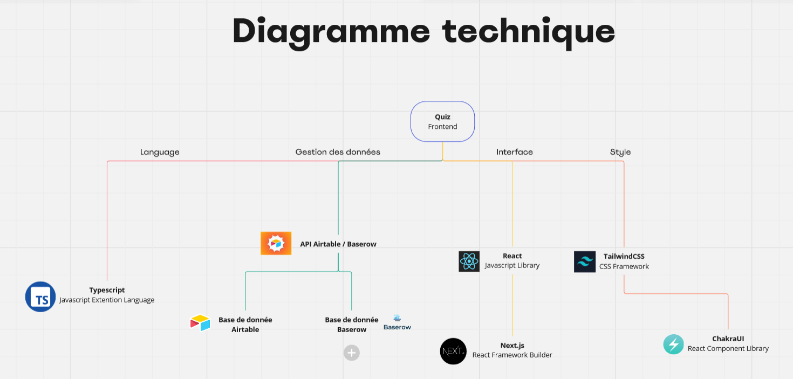

# Quiz - Ensemble contre le Sexisme

Ce repository contient le code du quiz Ensemble contre le Sexisme.
Il est possible de tester directement le quiz lié à cette page Github via l'outil de déploiement automatique Vercel, au lien suivant : [https://ecls-quiz.vercel.app/](https://ecls-quiz.vercel.app/) 

Diagramme technique de l'application :


Ce projet est créé à l'aide du Framework React [Next.js](https://nextjs.org/), créé à l'aide de la commande [`create-next-app`](https://github.com/vercel/next.js/tree/canary/packages/create-next-app), et utilise Tailwind CSS pour la forme.

Concernant la base de données, deux solutions sont implémentées :
- Airtable, solution actuellement en prod
- Baserow, solution fonctionnelle qui nous permet d'héberger nous-même les données (notamment en cas de problématiques RGPD)

Pour obtenir les accès à ces bases de données, vous pouvez actuellement contacter Paul Rousseau (paul.rousseau@student-cs.fr) ou Isabelle Dumont (isajudumont@gmail.com).

## Lancer l'application localement

First, run the development server:

```bash
npm run dev
# or
yarn dev
# or
pnpm dev
# or
bun dev
```

Open [http://localhost:3000](http://localhost:3000) with your browser to see the result.

You can start editing the page by modifying `app/page.tsx`. The page auto-updates as you edit the file.

This project uses [`next/font`](https://nextjs.org/docs/basic-features/font-optimization) to automatically optimize and load Inter, a custom Google Font.

## Learn More

To learn more about Next.js, take a look at the following resources:

- [Next.js Documentation](https://nextjs.org/docs) - learn about Next.js features and API.
- [Learn Next.js](https://nextjs.org/learn) - an interactive Next.js tutorial.

You can check out [the Next.js GitHub repository](https://github.com/vercel/next.js/) - your feedback and contributions are welcome!

## Deploy on Vercel

The easiest way to deploy your Next.js app is to use the [Vercel Platform](https://vercel.com/new?utm_medium=default-template&filter=next.js&utm_source=create-next-app&utm_campaign=create-next-app-readme) from the creators of Next.js.

Check out our [Next.js deployment documentation](https://nextjs.org/docs/deployment) for more details.
